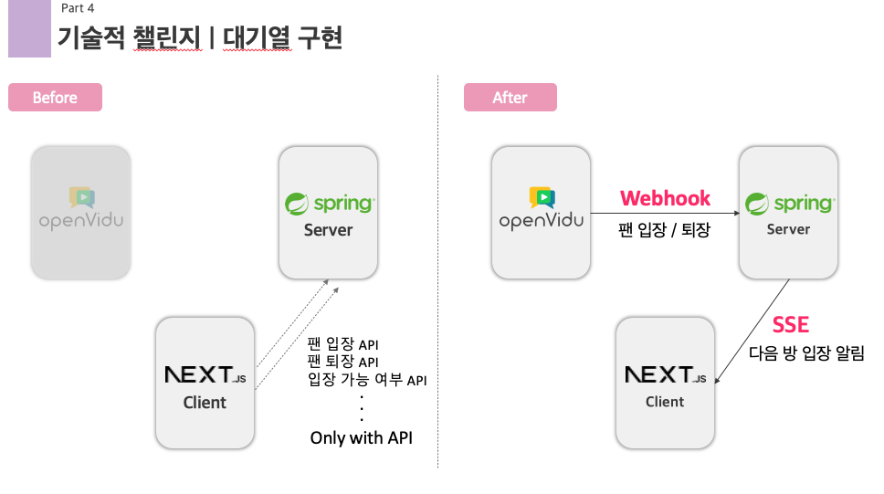
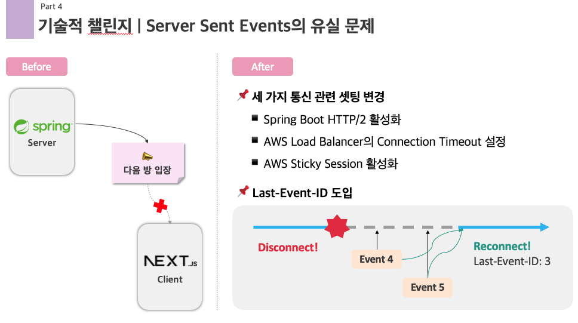
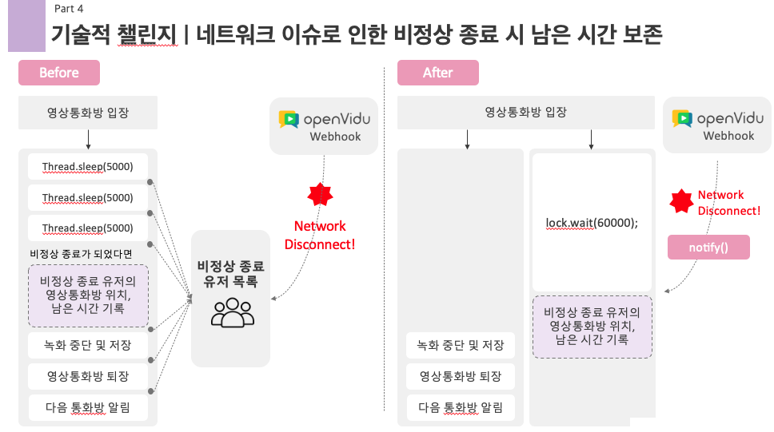
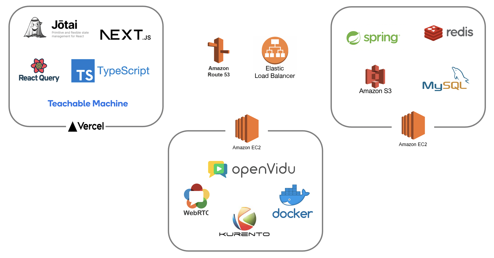
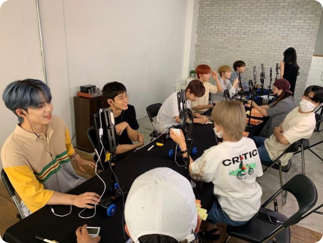
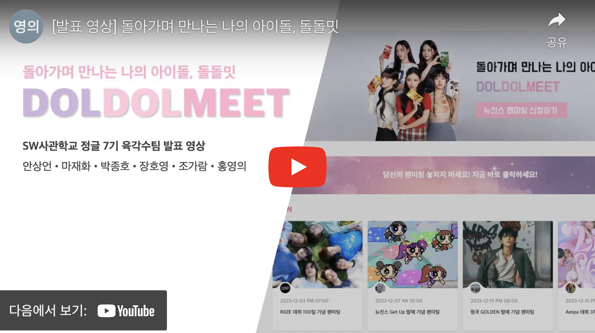
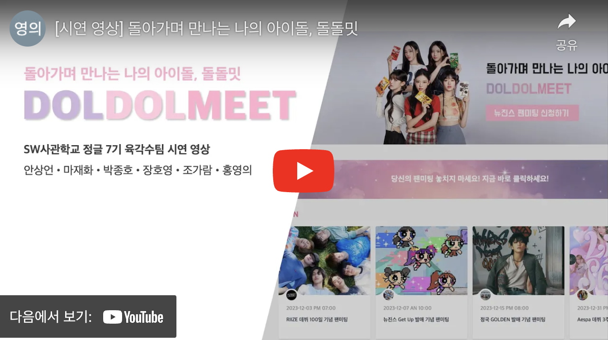

# 돌아가며 만나는 나의 아이돌, 돌돌밋

## 0. 프로젝트 개요

* SW사관학교 7기 나만의 무기 프로젝트
* 팀원: 6명 (팀장 안상언, 마재화, 박종호, 장호영, 조가람, 홍영의)
* 기간: 2023.11.08 - 2023.12.16 (5주)

## 1. 기술적 챌린지
### 1) 대기열 구현

* 문제: 여러번 API를 호출함에 따라 코드 복잡도가 증가
* 해결: 웹훅과 SSE 기반 구현으로 변경하며 기존의 API 요청 정보는 Openvidu에서 발생하는 Event를 웹훅으로 받아 대체할 수 있었고, 클라이언트에게 알림이 필요할 때는 SSE를 통해 데이터를 유저에게 전송

### 2) Server Sent Events의 유실 문제 해결

* 문제: 간헐적 SSE 유실 문제 발생하면서 팬이 다음 아이돌방으로 넘어가지 못함
* 해결: HTTP/2 활성화, connection timeout 설정, sticky session 활성화, SSE에 시간 기반 id 부여하여 유실된 이벤트 추적하여 재전송

### 3) 네트워크 이슈로 인한 비정상 종료시 남은 시간 보존

* 문제: 네트워크 끊김 유무 체크를 polling 방식으로 수행함에 따라 비효율적
* 해결: 네트워크 이슈 감지 쓰레드를 만들어 끊김 감지시 처리하도록 하여 비효율성 제거

## 2. 아키텍처

## 3. 기획의도

### 😢 일일이 영상통화를 걸고 끊고... 영통 팬싸 진행의 번거로움
* 소속사가 비대면 팬미팅, 소위 영통 팬싸를 진행함에 있어 여러 불편 요소가 존재함
* 소속사 직원이 팬들에게 일일이 영상통화를 걸고 끊어야 함
* 통화가 이루어지는 동안 옆에서 스탑워치로 통화 시간도 재고 있어야 함

### 😰 녹화 연습, 대본 준비, 하염없는 대기 시간... 팬들도 불편하긴 마찬가지
* 통화가 연결되자마자 녹화를 시작하는 연습도 해야 하고, 대본도 미리 준비해서 띄워놔야 함
* 현재 몇 번째 팬이 통화하고 있는지 알 수 없어 하염없이 대기해야 함
* 한국어를 못하는 외국인 팬들의 경우 대화가 어려운 문제가 있음

### 🤩 영통 팬싸, 쉽고 편하게 즐길 수 있도록 하자!
* 대기열 관리 시스템을 도입하여 일일이 통화시간을 재면서 전화를 걸고 끊을 필요가 없도록 하자
* 녹화 / 메모장 / 번역 기능 등을 도입하여 팬들이 좀더 편안하고 즐겁게 팬미팅을 즐길 수 있도록 하자

## 4. 발표 및 시연 영상

### 2-1. 발표 영상 (PPT 발표 포함)

### 2-2. 시연 영상 (PPT 발표 제외)

## 5. 주요 기능

### 1) 메인 대기실

* 나의 현재 대기 순서를 확인할 수 있고, 뮤직 비디오 감상이 가능합니다.

* 메모장에 하고 싶은 말을 미리 작성할 수 있고, 다른 팬들과의 채팅도 가능합니다.

### 2) 멤버별 영상통화 대기실

* 입장 순서가 다가오면 메인 대기실에서 아이돌 멤버별 영상통화 대기실로 이동합니다.

* 내 앞 순서 팬의 통화가 끝나면 일대일 영상통화방에 입장하게 됩니다.

### 3) 일대일 영상통화방
* 일대일 영상통화방 상단에는 현재 남은 시간이 표시됩니다.
* 상단의 버튼을 통해 마이크 / 카메라 / 자막 / 전체화면 모드를 키고 끌 수 있습니다.
* 좌측에는 채팅창과 메모장이 표시됩니다.

### 3-1) 일대일 영상통화방 - 채팅 / 음성 번역
* 외국인 팬들을 위해 채팅 번역 기능과 음성 인식 번역 기능을 제공합니다.

### 3-2) 일대일 영상통화방 - 모션 인식 캡쳐
* 통화시간이 10초 남으면 종료 임박 및 포토타임 알림이 뜹니다.
* 아이돌과 팬 모두 제시된 포즈를 취하면 자동으로 사진이 촬영됩니다.

### 4) 단체 게임

* 모든 아이돌 멤버와의 영상통화가 끝나면 단체 게임 페이지로 이동합니다.

### 5) 종료 페이지
* 모든 팬미팅 일정이 종료되면 종료 페이지로 이동합니다.
* 촬영된 사진과 녹화된 영상을 다운로드하거나 SNS에 공유할 수 있습니다.

